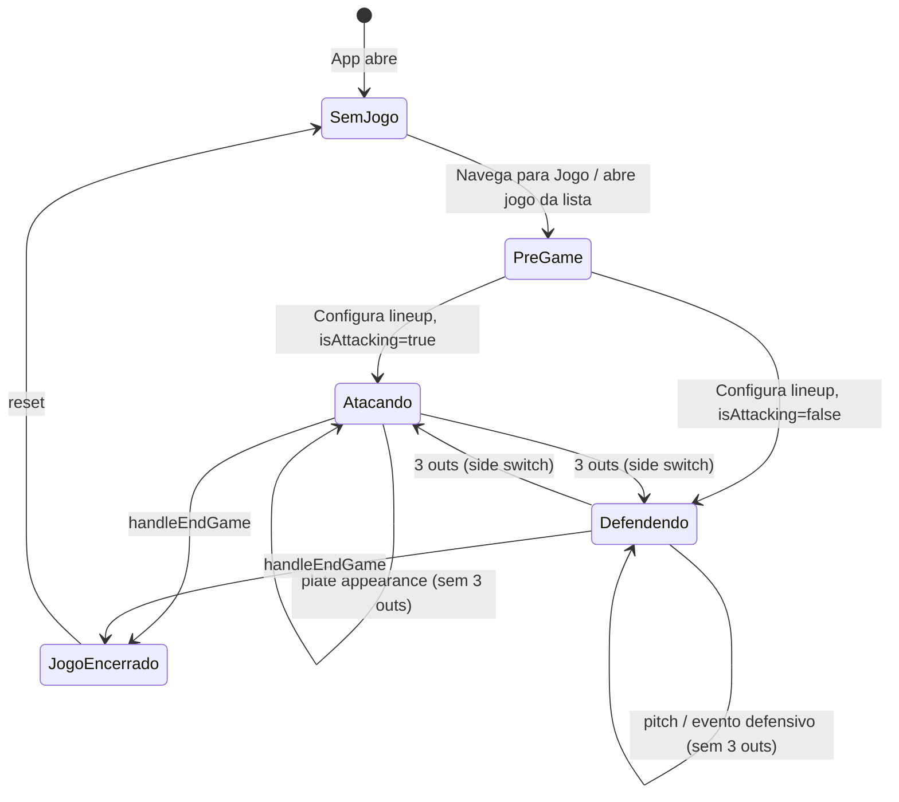

# Especificação do Game State

O `gameState` é o coração do InPlay — um objeto React que representa o estado completo e em tempo real de uma partida. Ele é persistido em `localStorage` a cada 350ms de debounce e restaurado automaticamente ao abrir o app.

---

## Estrutura Completa

```ts
interface GameState {
  // ── Identificação da partida ──────────────────────────────
  currentGameId: string | null
  preGameConfigured: boolean

  // ── Inning e Lado ─────────────────────────────────────────
  inning: number           // 1-based; começa em 1
  inningHalf: 'top' | 'bottom'
  isAttacking: boolean     // true = nosso time bate agora

  // ── Contagem ─────────────────────────────────────────────
  outs: number             // 0, 1, 2 (3 = side switch)
  balls: number            // 0–3 (4 = walk)
  strikes: number          // 0–2 (3 = strikeout)

  // ── Pitch Count ──────────────────────────────────────────
  pitchCount: number       // legado; espelha ourPitchCount
  ourPitchCount: number    // total de arremessos do nosso pitcher
  opponentPitchCount: number // total de arremessos do pitcher adversário
  pitchCounts: Record<string, number>  // { [pitcherId]: contagem }

  // ── Placar ───────────────────────────────────────────────
  homeScore: number        // pontos do NOSSO time
  awayScore: number        // pontos do ADVERSÁRIO
  inningScores: {
    home: number[]         // índice = inning-1; nosso time
    away: number[]         // índice = inning-1; adversário
  }

  // ── Jogadores em Campo ────────────────────────────────────
  onFieldPlayerIds: string[]      // IDs dos 9 titulares em campo
  participantPlayerIds: string[]  // onField + bench (todos da ficha)
  lineup: Array<{ playerId: string; position: string }>  // 9 starters + posição
  bench: string[]                 // IDs dos reservas

  // ── Ordem de Rebatida ─────────────────────────────────────
  battingOrder: string[]          // IDs em ordem de rebatida
  currentBatterIndex: number      // índice atual no battingOrder (cíclico)

  // ── Arremessador Atual ────────────────────────────────────
  currentPitcherId: string | null

  // ── Bases ─────────────────────────────────────────────────
  runners: {
    first: boolean | string   // false=vazia, true=corredor, string=playerId
    second: boolean | string
    third: boolean | string
  }

  // ── Adversário ────────────────────────────────────────────
  currentOpponentBatter: { number: string; name: string }
  opposingBatters: Record<string, {
    number: string; name: string
    atBats: number; hits: number; outs: number
    walks: number; strikeouts: number; homeRuns: number
  }>
  opponentLineup: Array<{ number: string; name: string } | null>  // 9 slots
  opponentLineupIndex: number   // slot atual (0-8, cíclico)
  opposingPitcher: { number: string; name: string }

  // ── Configurações ─────────────────────────────────────────
  maxInnings: number   // 0 = ilimitado

  // ── Histórico ─────────────────────────────────────────────
  gameLog: Array<{
    id: string
    ts: number
    inning: number
    half: 'top' | 'bottom'
    type: string
    description: string
  }>
  substitutions: Array<{
    id: string
    ts: number
    inning: number
    half: 'top' | 'bottom'
    playerInId: string
    playerInName: string
    position: string
    playerOutId: string | null
    playerOutName: string
  }>

  // ── Legado (mantido para compatibilidade) ─────────────────
  score: { home: number; away: number }
}
```

---

## Estado Inicial

```js
// utils/gameState.js — INITIAL_GAME_STATE
{
  inning: 1,
  inningHalf: 'top',
  outs: 0, balls: 0, strikes: 0,
  pitchCount: 0, ourPitchCount: 0, opponentPitchCount: 0,
  pitchCounts: {},
  homeScore: 0, awayScore: 0,
  inningScores: { home: [], away: [] },
  isAttacking: true,
  score: { home: 0, away: 0 },
  onFieldPlayerIds: [],
  participantPlayerIds: [],
  battingOrder: [],
  lineup: [], bench: [],
  currentBatterIndex: 0,
  runners: { first: false, second: false, third: false },
  currentPitcherId: null,
  currentGameId: null,
  preGameConfigured: false,
  gameLog: [],
  substitutions: [],
  currentOpponentBatter: { number: '', name: '' },
  opposingBatters: {},
  opponentLineup: [],
  opponentLineupIndex: 0,
  opposingPitcher: { number: '', name: '' },
  maxInnings: 0,
}
```

---

## Detalhamento de Cada Campo

### `currentGameId`
- **Tipo**: `string | null`
- **Significado**: ID do jogo atualmente ativo no banco de dados (local + backend).
- **Muda quando**: `gamesApi.create()` retorna o novo ID; `handleEndGame()` ou `handleDeleteGame()` anula.
- **Efeito colateral**: Ao mudar, dispara `useEffect` em `App.jsx` que carrega o setup do jogo.

### `preGameConfigured`
- **Tipo**: `boolean`
- **Significado**: Se a escalação (lineup + battingOrder) foi configurada via `PreGameSetupModal`.
- **Muda quando**: `onPreGameConfirm` é chamado; volta a `false` ao encerrar jogo.
- **Efeito colateral**: `FieldPage` exibe o modal de setup quando `false`.

### `inning`
- **Tipo**: `number` (1-based)
- **Muda quando**: Outs atingem 3 no half bottom (via `computeInningTransition`).
- **Regra**: `nextInning = inning + 1` apenas quando `inningHalf === 'bottom'` e `sideSwitch = true`.

### `inningHalf`
- **Tipo**: `'top' | 'bottom'`
- **Muda quando**: Outs atingem 3 (alternância automática top ↔ bottom).
- **Convenção**: `top` = adversário bate (`isAttacking = false`); `bottom` = nosso time bate (`isAttacking = true`).

### `isAttacking`
- **Tipo**: `boolean`
- **Muda quando**: Side switch (3 outs) ou configuração manual no pré-jogo.
- **Efeito colateral**: Determina qual painel de ações é exibido. Quando `false`, limpa `currentPitcherId`.

### `outs`
- **Tipo**: `number` (0–2; 3 causa side switch imediato)
- **Muda quando**: Qualquer evento que gera out: strikeout, plate-appearance-out, double play, removeRunner, sac fly.
- **Reset**: Para 0 após side switch.

### `balls`, `strikes`
- **Tipo**: `number`
- **Muda quando**: Ação de pitch: strike (+1), ball (+1), foul (condicionalmente +1 a strikes).
- **Reset**: Para 0 após qualquer at-bat completo.

### `ourPitchCount`
- **Tipo**: `number`
- **Muda quando**: Cada arremesso registrado no modo defensivo (via `syncPitchToPitcher` ou `syncDefensivePitcherEvent`).
- **Legado**: O campo `pitchCount` espelha `ourPitchCount` para compatibilidade.

### `pitchCounts`
- **Tipo**: `Record<string, number>`
- **Significado**: Contagem individual de arremessos por `pitcherId` nesta partida.
- **Muda quando**: `incrementPitcherCount(state)` é chamado em eventos defensivos.
- **Exibição**: `pitchCounts[currentPitcherId]` é exibido como "PC" no HUD do arremessador (síncrono — sem I/O).

### `homeScore`, `awayScore`
- **Tipo**: `number`
- **`homeScore`**: Pontos do NOSSO time.
- **`awayScore`**: Pontos do ADVERSÁRIO.
- **Muda quando**: `applyHitToBases`, `forceAdvanceToFirst`, `advanceRunner`, `applySacFly`, `applyWildPitch`, etc.

### `inningScores`
- **Tipo**: `{ home: number[], away: number[] }`
- **Índice**: `inning - 1` (inning 1 = índice 0).
- **Atualizado por**: `addInningRuns(inningScores, inning, ourRuns, theirRuns)`.
- **Usado para**: Exibição do Box Score na aba Ações.

### `onFieldPlayerIds`
- **Tipo**: `string[]`
- **Significado**: IDs dos jogadores atualmente em campo (máx. 9).
- **Muda quando**: PreGame setup, substituições, drag de bench para campo ou campo para bench.
- **Validação**: App resolve conflitos de posição automaticamente (último jogador na mesma posição prevalece).

### `lineup`
- **Tipo**: `Array<{ playerId: string; position: string }>`
- **Significado**: Escalação com posição. 1:1 com `onFieldPlayerIds`.
- **Muda quando**: PreGame, substituições, troca de posição (swap).
- **Importância**: Fonte de verdade para a posição de cada jogador. `player.activePosition` é derivado do lineup.

### `battingOrder`
- **Tipo**: `string[]` (lista de playerIds)
- **Muda quando**: PreGame configura; substituições podem trocar o slot do jogador substituído.
- **Uso**: `battingOrder[currentBatterIndex]` = ID do bater atual.

### `currentBatterIndex`
- **Tipo**: `number` (0-based, cíclico)
- **Muda quando**: Após cada at-bat completo: `(index + 1) % battingOrder.length`.
- **Regra**: Sempre `min(index, battingOrder.length - 1)` para evitar out-of-bounds.

### `currentPitcherId`
- **Tipo**: `string | null`
- **Muda quando**: Seleção automática (jogador com `activePosition = 'P'`), troca manual no seletor.
- **Nulo quando**: `isAttacking = true` (nosso time está rebatendo).

### `runners`
- **Tipo**: `{ first, second, third }` cada = `false | true | string`
- **`false`**: Base vazia.
- **`true`**: Corredor genérico (sem identificação).
- **`string`**: `playerId` do corredor (permite creditar SB).
- **Reset**: Para `{first: false, second: false, third: false}` após side switch.

### `gameLog`
- **Tipo**: Array de entradas de log.
- **Entradas**: `{ id, ts, inning, half, type, description }`.
- **Tipos de evento**: `game-start`, `hit-single`, `hit-double`, `hit-triple`, `hit-homerun`, `out`, `walk`, `hbp`, `sac-fly`, `error`, `double-play`, `wild-pitch`, `stolen-base`, `runner-advance`, `sub`, `swap`, `pitcher-change`, `def-out`, `def-walk`, `def-hit-single`, etc., `inning-end`.
- **Uso**: Exibido no GameDetailPage como play-by-play.

### `substitutions`
- **Tipo**: Array de registros de substituição.
- **Imutável**: Substituições não são removidas do array, mesmo com undo.

### `opposingBatters`
- **Tipo**: `Record<string (jersey number), BatterStats>`
- **Populado por**: `updateOppBatter(current, result)` após cada jogada do adversário.
- **Exibição**: Estatística do bater adversário atual no painel de ações.

### `opponentLineup` / `opponentLineupIndex`
- **Descobre** a ordem de rebatida do adversário conforme a partida avança.
- `advanceOpponentLineup(current)` grava o bater atual no slot `opponentLineupIndex` e avança o índice.
- Quando 9 jogadores registrados, os inputs de número/nome são pré-preenchidos automaticamente.

### `maxInnings`
- **Tipo**: `number` (0 = ilimitado)
- **Configurado no**: PreGame setup (`pregameForm.maxInnings`).
- **Uso**: Trigger de auto-end quando `inning > maxInnings` ou walkoff no último inning.

---

## Persistência

### localStorage
- **Chave**: `baseball_game_state_v2`
- **Debounce**: 350ms após cada mudança de `gameState`.
- **Restauração**: `getSavedGameState()` ao montar `App`. Se `currentGameId` for nulo, retorna `INITIAL_GAME_STATE`.

### Backend
- Salvo em `games.gameState` (campo Mixed do MongoDB) com debounce de 250ms.
- Campos persistidos no backend: tudo exceto `score` (legado) e `preGameConfigured` (recalculado).

---

## Diagrama de Fluxo de Estado


