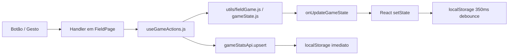

# Rules Engine — Motor de Regras

O motor de regras do InPlay é distribuído entre `App.jsx`, `useGameActions.js`, e as funções utilitárias em `utils/`. Não existe uma classe ou módulo único — as regras são funções puras aplicadas dentro de `setGameState` updaters.

---

## Arquitetura do Motor de Regras



---

## Regra: Strikeout por Count

**Nome**: `StrikeoutByCount`  
**Arquivo**: `App.jsx:handlePitchAction()` e `useGameActions.js:applyAttackCountAction()`

### Modo Defensivo (`handlePitchAction`)
```
Evento: strike / foul arremessado
Pré-condição: isAttacking = false
Lógica:
  nextStrikes = kind==='strike' ? strikes+1 : kind==='foul' ? min(2, strikes+1) : strikes
  se nextStrikes >= 3:
    didStrikeout = true
    outs += 1
    se outs >= 3: side switch
  stats: syncPitchToPitcher(kind, {didStrikeout, outsDelta: didStrikeout ? 1 : 0})
```

### Modo Ofensivo (`applyAttackCountAction`)
```
Evento: strike / foul registrado para o adversário
Pré-condição: isAttacking = true
Lógica: idêntica (espelhada)
  stats: upsertGameStat(batterId, { atBats+1, strikeouts+1, outs+1 })
```

---

## Regra: Walk por Count

**Nome**: `WalkByCount`  
**Arquivo**: `App.jsx:handlePitchAction()` e `useGameActions.js:applyAttackCountAction()`

```
Evento: ball arremessado
Pré-condição: balls = 3 (próximo ball = 4)
Lógica:
  didWalk = true
  forceAdvanceToFirst(runners) → nextRunners, scoredRuns
  reset: strikes = 0, balls = 0
  currentBatterIndex++
Estatísticas (defesa): syncPitchToPitcher('ball', { didWalk, earnedRunsDelta: scoredRuns })
  → walks +1, earnedRuns += scoredRuns
Estatísticas (ataque): upsertGameStat(batterId, { walks+1, rbi+scoredRuns })
```

---

## Regra: Forçar Avanço para 1ª Base

**Nome**: `ForceAdvanceToFirst`  
**Arquivo**: `utils/fieldGame.js:forceAdvanceToFirst(runners, batterId)`

```
Parâmetros: runners estado atual, batterId opcional (para SB tracking)
Lógica:
  se first = false: first = batterId||true, runs = 0
  senão se second=false: first=batterId||true, second=first, runs=0
  senão:
    se third: runs += 1  ← run scored (earned se walk/HBP; unearned se erro)
    third = second
    second = first
    first = batterId||true
Retorna: { nextRunners, runs }
```

> Nota: Walk com bases cheias (`first && second && third`) sempre resulta em 1 run.

---

## Regra: Avanço de Corredores por Hit

**Nome**: `HitRunnerAdvance`  
**Arquivo**: `utils/fieldGame.js:applyHitToBases(runners, hitType, batterId)`

```
homerun:
  runs = 1 + (first?1:0) + (second?1:0) + (third?1:0)
  nextRunners = { first:false, second:false, third:false }
  return { nextRunners, runs, bases:4 }

single/double/triple:
  bases = 1 / 2 / 3
  advanced = applyRunnerAdvance(runners, bases)
  nextRunners = advanced.nextRunners
  nextRunners[base correspondente] = batterId || true
  return { nextRunners, runs: advanced.runs, bases }
```

```
applyRunnerAdvance(runners, basesToAdvance):
  Para cada runner de 3ª → 1ª:
    targetIndex = currentIndex + basesToAdvance
    se targetIndex >= 3: runs += 1
    senão: nextRunners[base[targetIndex]] = runner
```

---

## Regra: Transição de Inning

**Nome**: `InningTransition`  
**Arquivo**: `utils/gameState.js:computeInningTransition(current, outsDelta)`

```
nextOuts = min(outs + outsDelta, 3)
sideSwitch = nextOuts >= 3
se sideSwitch:
  nextHalf = (inningHalf === 'top') ? 'bottom' : 'top'
  nextInning = (inningHalf === 'bottom') ? inning + 1 : inning
retorna: { nextOuts, sideSwitch, nextHalf, nextInning }
```

**Quem chama**: `applyDefensiveOutEvent`, `applyDoublePlayWithRunner`, `applySacFly`, `removeRunner`, `applyPlateAppearance`.

---

## Regra: Contagem de Arremessos por Pitcher

**Nome**: `PitcherCountTracking`  
**Arquivo**: `utils/gameState.js:incrementPitcherCount(state)` 

```
nextPitchCounts = { ...state.pitchCounts }
se currentPitcherId: nextPitchCounts[currentPitcherId] += 1
retorna: nextPitchCounts
```

Separado do `gameStatsApi.upsert` (local síncrono para exibição imediata no HUD).

---

## Regra: Seleção Automática de Pitcher

**Nome**: `AutoPitcherSelection`  
**Arquivo**: `App.jsx` (useEffect com deps: `players`, `gameState.isAttacking`, `onFieldPlayerIds`, `currentPitcherId`)

```
se isAttacking: currentPitcherId = null (nosso time bate)
senão:
  onFieldPitchers = players com activePosition='P' em onFieldPlayerIds
  se currentPitcherId ainda válido: manter
  senão: currentPitcherId = onFieldPitchers[0]._id || null
se mudou: setGameState com novo currentPitcherId
```

---

## Regra: Oponente Lineup Discovery

**Nome**: `OpponentLineupDiscovery`  
**Arquivo**: `utils/fieldGame.js:advanceOpponentLineup(current)`

```
lineup = [...opponentLineup]  // 9 slots (null se desconhecido)
idx = opponentLineupIndex % 9
se currentOpponentBatter.number: lineup[idx] = { number, name }
nextIdx = (idx + 1) % 9
nextBatter = lineup[nextIdx] || { number: '', name: '' }
retorna: { opponentLineup: lineup, opponentLineupIndex: nextIdx, currentOpponentBatter: nextBatter }
```

Após 9 jogadores registrados, o campo auto-preenche com os batedores conhecidos.

---

## Regra: Detecção de Fim de Jogo

**Nome**: `AutoGameEnd`  
**Arquivo**: `FieldPage.jsx` (useEffect com deps: `inning`, `maxInnings`, `homeScore`, `awayScore`, etc.)

```
maxInn = maxInnings (0 = desabilitado)
se maxInn > 0 e currentGameId e preGameConfigured:
  se inning > maxInn e não mostrado 'limit':
    exibir "Limite de X innings atingido"
  se inning >= maxInn e half='bottom' e isAttacking e homeScore > awayScore e não mostrado 'walkoff':
    exibir "Walk-off! Vencemos!"
```

---

## Regra: Conflito de Posição

**Nome**: `PositionConflictResolution`  
**Arquivo**: `FieldPage.jsx` (useEffect com deps: `onFieldPlayerIds`, `lineup`)

Quando dois jogadores do `onFieldPlayerIds` têm a mesma posição no lineup:

```
Para jogadores em campo (reversed):
  se posição já vista: remove o mais antigo (índice menor)
keep = deduplicated por posição
se keep.length < onField.length:
  onFieldPlayerIds = keep
  battingOrder = keep
  lineup = keep
  bench = todos menos keep
```

---

## Regra: Recover após Restart (getSavedGameState)

**Nome**: `StateHydration`  
**Arquivo**: `utils/gameState.js:getSavedGameState()`

```
raw = localStorage.getItem('baseball_game_state_v2')
se raw e currentGameId:
  parsed = JSON.parse(raw)
  migrar: ourPitchCount ← pitchCount se necessário
  migrar: homeScore ← score.home se necessário
  validar: todos os arrays devem ser Array
  validar: runners deve ter first/second/third
  retorna { ...INITIAL_GAME_STATE, ...parsed, migrated... }
senão:
  retorna INITIAL_GAME_STATE (sem jogo ativo = estado limpo)
```

---

## Regra: Sync e ID Remapping

**Nome**: `ServerIdRemapping`  
**Arquivo**: `services/api.js:replaceIdInStores()`

Após sync com servidor: o `_id` local (formato `timestamp-random`) é substituído pelo ObjectId do MongoDB.

```
Para players:
  lfGet(LS.players) → encontra pelo _id local → substitui pelo record do servidor
  lfGet(LS.gameStats) → stats com playerId=localId → atualiza para serverId

Para games:
  mesma lógica para gameId em gameStats
```

Razão: evita o bug de `_id` stale — por isso `gameStatsApi.upsert` usa composite key (gameId, playerId), nunca `_id`.

---

## Regra: Undo (Desfazer)

**Nome**: `UndoAction`  
**Arquivo**: `useGameActions.js:handleUndo()`

```
snapshot = undoStack.pop()
se não existe: mostrar "Nada para desfazer"
senão:
  onUpdateGameState(snapshot.stateSnapshot)      ← restaura gameState
  para cada (playerId, statSnapshot) em snapshot.statsSnapshot:
    gameStatsApi.upsert(gameId, playerId, statSnapshot)  ← restaura stats
  para cada entry em currentStats não presente no snapshot:
    gameStatsApi.upsert(gameId, entry.playerId, EMPTY_GAME_STAT)  ← zera stats novas
```

**Captura** (`captureUndoSnapshot`): Chamada **antes** de cada ação. Snapshot inclui JSON.stringify do gameState + lista de todas as stats do jogo.

Limite: pilha de 80 snapshots. Aviso ao usuário quando chega perto do limite.
