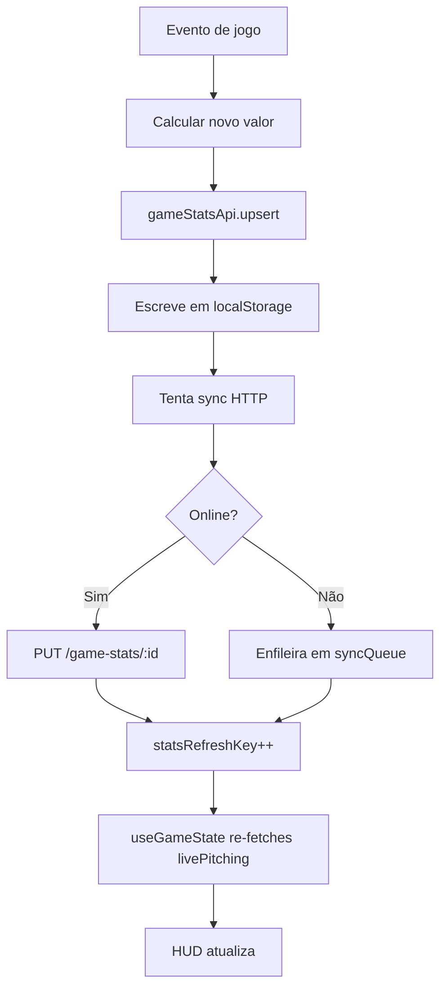

# Estatísticas — Especificação Completa

Todas as estatísticas implementadas no InPlay, com fórmulas, fontes e comportamentos.

---

## Estrutura de Dados de Estatísticas

### Por Jogo (`GameStat`)

```ts
interface GameStat {
  _id: string
  gameId: string
  playerId: string
  teamId: string
  type: 'hitter' | 'pitcher'
  hitting: HittingStats
  pitching: PitchingStats
  defense: DefenseStats
  events: Array<{ type: string; createdAt: Date; note: string }>
}
```

### Por Temporada (`SeasonStat` — agregado)

Calculado em `seasonStatsApi.list()` somando todos os `GameStat` do time. Não é uma coleção persistida — é sempre computado ao vivo do localStorage.

---

## Estatísticas de Rebatida

### Campos Armazenados

```ts
interface HittingStats {
  atBats: number         // AB — turno de rebatida com possibilidade de out
  hits: number           // H
  doubles: number        // 2B
  triples: number        // 3B
  homeRuns: number       // HR
  strikeouts: number     // SO (K)
  outs: number           // OUT — total de eliminações como rebatedor
  walks: number          // BB
  runs: number           // R — pontos marcados
  rbi: number            // RBI — pontos impulsionados
  stolenBases: number    // SB
  hitByPitch: number     // HBP
  sacrificeFlies: number // SF
  caughtStealing: number // CS (atualizado manualmente no GameDetailPage)
}
```

### Estatísticas Derivadas

| Stat | Fórmula | Notas |
|------|---------|-------|
| AVG | H / AB | `.000` se AB=0 |
| OBP | (H + BB + HBP) / (AB + BB + HBP + SF) | `'---'` se denominador=0 |
| SLG | (H + 2B + 2×3B + 3×HR) / AB | `'---'` se AB=0 |
| OPS | OBP + SLG | `'---'` se algum for `'---'` |
| K% | (SO / PA) × 100 + `%` | PA = AB + BB + HBP + SF |
| BB% | (BB / PA) × 100 + `%` | — |

> **Nota sobre SLG**: `H` já inclui os singles. A fórmula adiciona 1 extra por 2B, 2 extras por 3B, 3 extras por HR. Total Bases = H + 2B + 2×3B + 3×HR.

### Quando Cada Campo Muda

| Evento | AB | H | 2B | 3B | HR | SO | OUT | BB | R | RBI | SB | HBP | SF | CS |
|--------|----|----|----|----|----|----|-----|----|----|-----|----|-----|----|----|
| Single | ✓ | ✓ | | | | | | | | +runs | | | | |
| Double | ✓ | ✓ | ✓ | | | | | | | +runs | | | | |
| Triple | ✓ | ✓ | | ✓ | | | | | | +runs | | | | |
| Home Run | ✓ | ✓ | | | ✓ | | | | ✓ | +runs | | | | |
| Strikeout | ✓ | | | | | ✓ | ✓ | | | | | | | |
| Out (genérico) | ✓ | | | | | | ✓ | | | | | | | |
| Walk | | | | | | | | ✓ | | +forced | | | | |
| HBP | | | | | | | | | | | | ✓ | | |
| Sac Fly | | | | | | | | | | +1 | | | ✓ | |
| Error (bater) | ✓ | | | | | | | | | | | | | |
| Stolen Base | | | | | | | | | | | ✓ | | | |

---

## Estatísticas de Arremesso

### Campos Armazenados

```ts
interface PitchingStats {
  outsPitched: number      // SOURCE OF TRUTH para IP/ERA
  inningsPitched: number   // Display: floor(outs/3) + (outs%3)/10
  earnedRuns: number       // ER — pontos ganhos (sem erros)
  strikeouts: number       // SO
  walks: number            // BB concedidos
  strikes: number          // Strikes arremessados acumulados
  balls: number            // Balls arremessados acumulados
  pitchCount: number       // Total de arremessos
  hitsAllowed: number      // H concedidos
  wildPitches: number      // WP
  wins: number             // W (manual no GameDetailPage)
  losses: number           // L (manual)
  saves: number            // SV (manual)
  pitchTypes: {            // Contagem por tipo de arremesso
    FB: number; CV: number; SL: number
    CH: number; SI: number; CT: number; other: number
  }
}
```

### Estatísticas Derivadas

| Stat | Fórmula | Função | Notas |
|------|---------|--------|-------|
| ERA | (ER × 27) / outsPitched | `formatEraFromOuts` | `'--'` se outsPitched=0 |
| IP | `floor(outs/3)`.`outs%3` | `formatIpFromOuts` | Ex: 7 outs → "2.1" |
| WHIP | (BB + H) / (outs/3) | `whipFromPitching` | `'---'` se outsPitched=0 |
| K/9 | (SO × 9) / (outs/3) | `k9FromPitching` | `'---'` se outsPitched=0 |

### Por Que `outsPitched` é o Source of Truth

O formato IP (`inningsPitched`) é decimal notacional, não aritmético:
- 1.2 IP = 1 inning + 2 outs = 5 outs totais
- Somar 1.2 + 2.2 = 3.4 (errado) — deveria ser 4.1 (5 + 8 = 13 outs)
- Somar `outsPitched`: 5 + 8 = 13 → `floor(13/3)=4`, `13%3=1` → IP "4.1" ✓

### Cálculo de ERA

```
ERA = (earnedRuns × 27) / outsPitched
    = earnedRuns × 9 / (outsPitched / 3)
    = earnedRuns × 9 / ipDecimal
```

Se `outsPitched = 0`: fallback para `(ER × 9) / inningsPitched`.

### Exibição no HUD ao Vivo (FieldPage — modo defensivo)

| Campo HUD | Fonte | Sincronização |
|-----------|-------|---------------|
| IP | `livePitching.outsPitched` → `formatIpFromOuts` | Via `useGameState({ refreshKey })` |
| ERA | `livePitching.outsPitched` + `earnedRuns` | Via refreshKey |
| SO | `livePitching.strikeouts` | Via refreshKey |
| BB | `livePitching.walks` | Via refreshKey |
| STR | `livePitching.strikes` | Via refreshKey |
| BAL | `livePitching.balls` | Via refreshKey |
| PC | `gameState.pitchCounts[currentPitcherId]` | **Síncrono** (não via refreshKey) |

---

## Estatísticas Defensivas

```ts
interface DefenseStats {
  errors: number       // E
  doublePlays: number  // DP
  flyOuts: number      // FO
  groundOuts: number   // GO
  lineOuts: number     // LO
}
```

| Stat | Quando Incrementa |
|------|------------------|
| E | `applyErrorEvent(defenderId)` em modo defensivo |
| DP | `applyDoublePlayWithRunner(runnerBase, [defenderIds])` |
| FO | `applyDefensiveOutEvent('flyout', fielderId)` |
| GO | `applyDefensiveOutEvent('groundout', fielderId)` |
| LO | `applyDefensiveOutEvent('lineout', fielderId)` |

---

## Colunas de Exibição (StatsPage)

### Rebatedores

```js
// constants/statColumns.js — HITTER_COLS
['AB', 'H', '2B', '3B', 'HR', 'R', 'RBI', 'BB', 'SO', 'SB', 'CS', 'HBP', 'SF', 'OUT',
 'AVG', 'OBP', 'SLG', 'OPS', 'K%', 'BB%']
```

### Arremessadores

Exibido no StatsPage: IP, ERA, SO, BB, H (allowed), PC, WHIP, K/9, W, L, SV.

### Defesa

```js
// constants/statColumns.js — DEFENSE_COLS
['E', 'DP', 'FO', 'GO', 'LO']
```

---

## Armazenamento e Persistência

### Chave Composta (upsert)

Toda escrita de stat vai para `gameStatsApi.upsert(gameId, playerId, payload)`:

```js
// Busca pelo composite key (gameId, playerId)
const idx = all.findIndex(s =>
  s.gameId === gameId && String(s.playerId?._id || s.playerId) === pid
)
```

**Nunca** buscar por `_id` (pode ser stale após sync com servidor).

### Sincronização Backend

Após `upsert` local: `netWrite('put', /game-stats/${id}, payload)` assíncrono.
Se offline: `queueSync('put', ...)`.

---

## Ciclo de Vida de uma Stat



---

## Resumo de Temporada — Computed Aggregation

`seasonStatsApi.list()` agrega todos os `GameStat` em memória (sem chamada HTTP):

```js
// Para cada entrada de gameStats no localStorage:
agg.hitting.atBats += safeN(h.atBats)
agg.hitting.hits   += safeN(h.hits)
// ...

// Pitching: sempre somar outsPitched
agg.pitching.outsPitched += safeN(p.outsPitched)
// NO FIM:
agg.pitching.inningsPitched = floor(outs/3) + (outs%3)/10
agg.era = ipDecimal ? (agg.pitching.earnedRuns / ipDecimal) * 9 : 0
```

`roleSummary.pitcherGames` e `hitterGames` contam quantos jogos o jogador atuou como P vs hitter.

---

## Validações de Dados

- `safeNumber(v)`: converte para número, retorna 0 se inválido (`utils/number.js`).
- Backend: `toSafeStatValue(value)`: retorna 0 se `< 0` ou `!isFinite`.
- Backend: `pitchCount = max(pitchCount, strikes + balls)` — mantém coerência mínima.
- Campos `wins`, `losses`, `saves` são editáveis manualmente no `GameDetailPage`.
