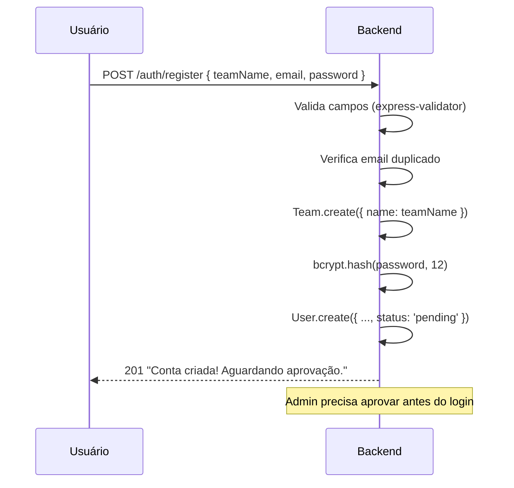
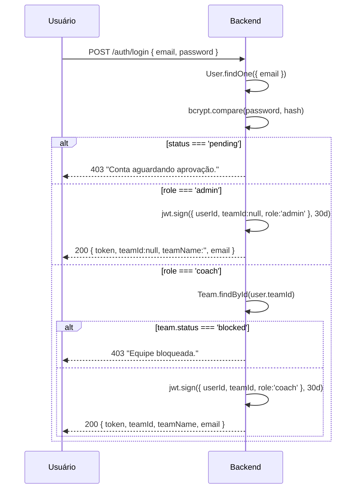

# Autenticação e Autorização

---

## Modelo de Usuário

| Campo | Tipo | Valores |
|-------|------|---------|
| `email` | string | único, normalizado |
| `passwordHash` | string | bcrypt 12 rounds |
| `teamId` | ObjectId | referência ao Team |
| `role` | enum | `coach` \| `admin` |
| `status` | enum | `pending` \| `active` |

---

## Fluxo de Registro



**Regras**:
- Novo usuário nasce com `status: 'pending'` — não pode logar até aprovação.
- Novo time nasce com `status: 'active'` e `billingStatus: 'trial'`.
- Rate limit: 10 tentativas por 15 min por IP.

---

## Fluxo de Login



---

## JWT

### Payload

```json
{
  "userId": "64abc123...",
  "teamId": "64def456...",
  "role": "coach",
  "iat": 1750000000,
  "exp": 1752592000
}
```

Para `admin`, `teamId` é `null`.

### Duração

- Tokens expiram em **30 dias**.
- Refresh automático: `POST /auth/refresh` com o token atual.
- Refresh verifica se o time não foi bloqueado antes de emitir novo token.

---

## Papéis (Roles)

| Role | Acesso |
|------|--------|
| `coach` | Todas as funcionalidades do app (jogadores, jogos, stats). Não vê `/admin`. |
| `admin` | Apenas o painel `/admin`. Não tem `teamId` → não pode criar jogadores/jogos. |

O `admin` é um usuário especial que gerencia o SaaS — aprova novos times, bloqueia, altera billing.

---

## Status de Times

| Status | Efeito |
|--------|--------|
| `active` | Normal — login permitido. |
| `blocked` | Login bloqueado. Usuários ativos são detectados via `/auth/ping` e forçados a logout. |

---

## Persistência do Auth no Frontend

```js
// frontend/src/services/api.js
const AUTH_KEY = 'baseball_auth_v1'

// Salvo no localStorage (não prefixado por teamId):
{
  "token": "eyJhbGc...",
  "teamId": "64abc...",
  "teamName": "CAASO Baseball",
  "email": "coach@email.com"
}
```

O token é lido antes de cada requisição via interceptor do axios:
```js
http.interceptors.request.use(cfg => {
  const auth = getAuth()
  if (auth?.token) cfg.headers.Authorization = `Bearer ${auth.token}`
  return cfg
})
```

---

## Detecção de Bloqueio em Tempo Real

O frontend faz polling a cada 30 segundos em `/auth/ping`:

```js
const id = window.setInterval(() => {
  if (navigator.onLine) checkStatus().catch(() => {})
}, 30_000)
```

Se a resposta for 403, o interceptor de response dispara:

```js
http.interceptors.response.use(null, err => {
  const status = err?.response?.status
  const msg = err?.response?.data?.message || ''
  if (status === 401 || (status === 403 && msg.includes('bloqueada'))) {
    window.dispatchEvent(new Event('baseball:logout'))
  }
  return Promise.reject(err)
})
```

App.jsx escuta o evento `baseball:logout` e chama `handleLogout()`.

---

## Logout

```js
// services/api.js
export function logout() {
  const auth = getAuth()
  if (auth?.teamId) {
    // Remove todas as chaves de localStorage do time atual
    Object.keys(localStorage)
      .filter(k => k.startsWith(`baseball_lf_${auth.teamId}_`))
      .forEach(k => localStorage.removeItem(k))
  }
  localStorage.removeItem(AUTH_KEY)
}
```

Após logout:
1. `gameState` é resetado para `INITIAL_GAME_STATE`.
2. `players` é limpo (`[]`).
3. `auth` é setado para `null`.
4. UI exibe a tela de login.

---

## Modo Offline (sem backend)

O app funciona completamente sem backend:

- Se `VITE_API_URL` não está definido ou contém `"YOUR_BACKEND"`, `http = null`.
- Sem http client: nenhuma chamada de rede é tentada.
- Dados ficam em localStorage com prefixo `baseball_lf_local_` (teamId = `"local"`).
- Auth local: o app aceita qualquer "login" — não há validação de senha em modo 100% offline.

> **Prática atual**: O frontend usa localStorage como primário mesmo quando conectado. O backend é camada de sync secundária.
