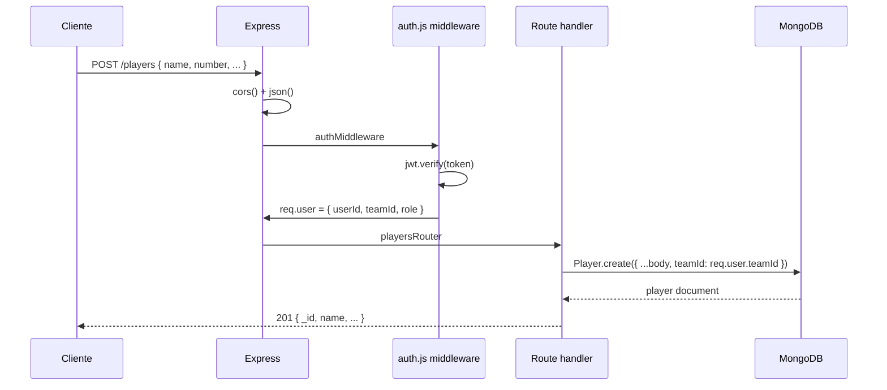

# Backend — Arquitetura

Documentação completa da estrutura backend do InPlay.

---

## Stack Tecnológico

| Tecnologia | Versão | Uso |
|-----------|--------|-----|
| Node.js | 18+ | Runtime |
| Express.js | 4+ | Framework HTTP |
| MongoDB | 6+ | Banco de dados |
| Mongoose | 7+ | ODM (modelos + validações) |
| JWT (`jsonwebtoken`) | — | Autenticação |
| bcrypt | — | Hash de senhas (12 rounds) |
| express-validator | — | Validação de input |
| express-rate-limit | — | Rate limiting |
| CORS (`cors`) | — | Cross-origin |
| dotenv | — | Variáveis de ambiente |

---

## Estrutura de Arquivos

```
backend/
├── package.json
├── .env                          # Variáveis de ambiente (não comitado)
└── src/
    ├── server.js                 # Entry point: Express app + MongoDB connect
    ├── models/
    │   ├── Team.js               # Schema de times
    │   ├── User.js               # Schema de usuários (coach/admin)
    │   ├── Player.js             # Schema de jogadores
    │   ├── Game.js               # Schema de jogos
    │   └── GameStat.js           # Schema de stats por jogo
    ├── routes/
    │   ├── auth.js               # /auth/register, /login, /refresh
    │   ├── players.js            # /players CRUD
    │   ├── games.js              # /games CRUD
    │   ├── gameStats.js          # /game-stats CRUD + upsert
    │   ├── seasonStats.js        # /season-stats (agregação)
    │   ├── stats.js              # /stats (legado/compat)
    │   ├── admin.js              # /admin — gestão de times e usuários
    │   └── export.js             # /export — exportação de dados
    └── middleware/
        ├── auth.js               # Verifica JWT + injeta req.user
        ├── adminOnly.js          # Exige role='admin'
        └── validate.js           # Executa resultado do express-validator
```

---

## server.js — Entry Point

```js
// Ordem de inicialização:
// 1. dotenv.config()
// 2. Express + middleware global (CORS, JSON parse 100kb)
// 3. Montagem de rotas
// 4. mongoose.connect() → app.listen()

app.set('trust proxy', 1)   // necessário para rate limit funcionar atrás de proxy (Render, Vercel)
```

### Montagem de Rotas

| Rota | Middleware | Arquivo |
|------|-----------|---------|
| `/auth/*` | nenhum (pública) | `routes/auth.js` |
| `/auth/ping` | `authMiddleware` | inline em server.js |
| `/players/*` | `authMiddleware` | `routes/players.js` |
| `/stats/*` | `authMiddleware` | `routes/stats.js` |
| `/games/*` | `authMiddleware` | `routes/games.js` |
| `/game-stats/*` | `authMiddleware` | `routes/gameStats.js` |
| `/season-stats/*` | `authMiddleware` | `routes/seasonStats.js` |
| `/export/*` | `authMiddleware` | `routes/export.js` |
| `/admin/*` | `authMiddleware` + `adminOnly` | `routes/admin.js` |

### Variáveis de Ambiente Necessárias

| Variável | Exemplo | Obrigatório |
|----------|---------|-------------|
| `PORT` | `4000` | Não (default 4000) |
| `MONGODB_URI` | `mongodb+srv://...` | Sim |
| `JWT_SECRET` | string aleatória longa | Sim |
| `FRONTEND_URL` | `https://app.inplay.com` | Não (sem CORS restrito) |

---

## Middleware

### `auth.js`

```js
// Extrai token do header: Authorization: Bearer {token}
// Verifica com jwt.verify(token, JWT_SECRET)
// Injeta req.user = { userId, teamId, role }
// Em falha: 401 { message: 'Token inválido ou expirado.' }
```

### `adminOnly.js`

```js
// Exige req.user.role === 'admin'
// Em falha: 403 { message: 'Acesso restrito.' }
```

### `validate.js`

```js
// Coleta erros do express-validator (via validationResult)
// Se há erros: 400 { errors: [...] }
// Se sem erros: next()
```

---

## Modelos Mongoose

### Team

```js
{
  name: String (required, trim),
  status: enum['active', 'blocked'] default 'active',
  billingStatus: enum['trial', 'paid', 'unpaid'] default 'trial',
  billingNotes: String default '',
  timestamps: true
}
```

### User

```js
{
  email: String (required, unique, lowercase, trim),
  passwordHash: String (required),  // bcrypt 12 rounds
  teamId: ObjectId → Team,
  role: enum['coach', 'admin'] default 'coach',
  status: enum['pending', 'active'] default 'pending',
  timestamps: true
}
// Índices: email (unique), teamId
```

### Player

```js
{
  teamId: ObjectId → Team (required),
  name: String (required, trim),
  number: Number (required),
  positions: [String] (required, enum VALID_POSITIONS),
  activePosition: String (required, enum VALID_POSITIONS),
  x: Number default 50,
  y: Number default 50,
  timestamps: true
}
// VALID_POSITIONS: ['P', 'C', '1B', '2B', '3B', 'SS', 'LF', 'CF', 'RF', 'DH']
```

### Game

```js
{
  teamId: ObjectId → Team (required),
  gameId: String,  // = _id.toString() — campo redundante para compatibilidade
  date: Date (required),
  opponent: String (required, trim),
  opponentName: String (trim, default ''),
  competition: String (required, trim),
  location: String (trim, default ''),
  isAttacking: Boolean default true,
  battingOrder: [String] default [],
  lineup: [{ playerId: String, position: String }] default [],
  bench: [String] default [],
  isFinished: Boolean default false,
  finishedAt: Date|null,
  gameState: Mixed default {},
  timestamps: true
}
// Índices: teamId, gameId, { date:-1, competition:1 }
```

### GameStat

```js
{
  teamId: ObjectId → Team (required),
  gameId: ObjectId → Game (required),
  playerId: ObjectId → Player (required),
  type: enum['hitter', 'pitcher'] default 'hitter',
  hitting: { atBats, hits, strikeouts, outs, walks, runs, rbi, homeRuns },
  pitching: {
    inningsPitched, outsPitched, earnedRuns, strikeouts, walks,
    strikes, balls, pitchCount, hitsAllowed,
    pitchTypes: { FB, CV, SL, CH, SI, CT, other }
  },
  defense: { errors, doublePlays, flyOuts, groundOuts, lineOuts },
  events: [{ type: String, createdAt: Date, note: String }],
  timestamps: true
}
// Índice único: { gameId: 1, playerId: 1 }
```

---

## Isolamento de Dados

Toda query ao MongoDB usa `teamId: req.user.teamId`. Isso é aplicado em **todos** os handlers de route — não há bypass.

```js
// Padrão encontrado em todos os routers:
const items = await Model.find({ teamId: req.user.teamId })
const item  = await Model.findOne({ _id: req.params.id, teamId: req.user.teamId })
```

Se um cliente enviar um `_id` pertencente a outro time, `findOne` retorna `null` → resposta 404.

---

## Deploy

O backend é stateless (sem session em memória). Pode ser hospedado em:

- **Render** (recomendado): `npm start` com variáveis de ambiente configuradas no painel.
- **Vercel** (serverless): requer adaptador Express → handler serverless.
- **Railway**, **Fly.io**, etc.

### Scripts

```json
// package.json
{
  "scripts": {
    "start": "node src/server.js",
    "dev": "nodemon src/server.js"
  }
}
```

---

## Rate Limiting

Aplicado em `POST /auth/register` e `POST /auth/login`:

```js
rateLimit({
  windowMs: 15 * 60 * 1000,  // 15 minutos
  max: 10,                    // 10 tentativas por IP
  message: { message: 'Muitas tentativas. Tente novamente em 15 minutos.' }
})
```

`app.set('trust proxy', 1)` é necessário para que o Express leia o IP real do cliente quando atrás de um proxy (Render, Nginx, etc.).

---

## Fluxo de Requisição


