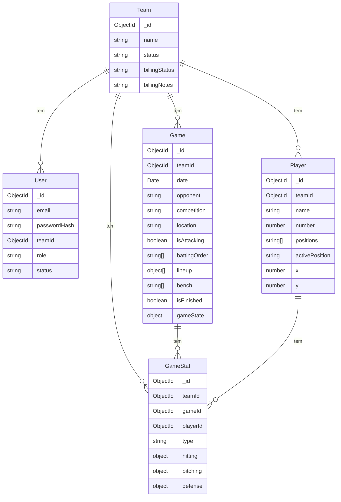

# Banco de Dados

O InPlay usa **duas camadas de persistência**: localStorage (primária, local-first) e MongoDB via backend (opcional, sync).

---

## Camada 1: localStorage (Local-First)

### Chaves e Estruturas

| Chave localStorage | Conteúdo | Escopo |
|-------------------|----------|--------|
| `baseball_auth_v1` | `{ token, teamId, teamName, email }` | Global (não prefixado por time) |
| `baseball_lf_{teamId}_players_v1` | `Player[]` | Por time |
| `baseball_lf_{teamId}_games_v1` | `Game[]` | Por time |
| `baseball_lf_{teamId}_gamestats_v1` | `GameStat[]` | Por time |
| `baseball_lf_{teamId}_syncqueue_v1` | `SyncQueueItem[]` | Por time |
| `baseball_game_state_v2` | `GameState` | Global (1 jogo por vez) |
| `_lf_v1_done` | `"1"` | Flag de migração única |

> `{teamId}` é o ObjectId MongoDB do time. Para usuários sem login: usa literal `"local"`.

### Formato da Chave

```js
function lsKey(name) {
  const teamId = getAuth()?.teamId || 'local'
  return `baseball_lf_${teamId}_${name}_v1`
}
```

### Estrutura Player (localStorage)

```ts
interface LocalPlayer {
  _id: string           // local ID ou MongoDB ObjectId após sync
  name: string
  number: number
  positions: string[]   // ['P', 'C', '1B', ...]
  activePosition: string
  x: number             // posição no campo (0-100)
  y: number
  pitchCountLimit?: number | null
  pitchRepertoire?: string[]  // ex: ['FB', 'CV', 'SL']
  // campos adicionados pelo backend:
  teamId?: string
  createdAt?: string
  updatedAt?: string
}
```

### Estrutura Game (localStorage)

```ts
interface LocalGame {
  _id: string
  teamId?: string
  date: string          // ISO date
  opponent: string
  opponentName: string
  competition: string
  location: string
  isAttacking: boolean
  battingOrder: string[]
  lineup: Array<{ playerId: string; position: string }>
  bench: string[]
  isFinished: boolean
  finishedAt: string | null
  gameState: GameState  // estado completo da partida
  maxInnings?: number
  createdAt?: string
  updatedAt?: string
}
```

### Estrutura GameStat (localStorage)

```ts
interface LocalGameStat {
  _id: string           // local ID ou MongoDB ObjectId
  gameId: string
  playerId: string
  teamId?: string
  type: 'hitter' | 'pitcher'
  hitting: HittingStats
  pitching: PitchingStats
  defense: DefenseStats
  events?: Array<{ type: string; createdAt: string; note: string }>
  createdAt?: string
  updatedAt?: string
}
```

### Estrutura SyncQueueItem

```ts
interface SyncQueueItem {
  method: 'post' | 'put' | 'delete'
  url: string           // ex: '/players', '/games/123', '/game-stats/456'
  data: object | null
  _ts: number           // timestamp
  localId: string | null  // ID local para remapping após POST bem-sucedido
}
```

---

## Camada 2: MongoDB (Backend)

### Modelo: Team

```js
// backend/src/models/Team.js
{
  name: String (required, trim)
  status: enum['active', 'blocked'] default 'active'
  billingStatus: enum['trial', 'paid', 'unpaid'] default 'trial'
  billingNotes: String default ''
  createdAt, updatedAt  // timestamps automáticos
}
```

**Índices**: `_id` (padrão MongoDB).

### Modelo: User

```js
// backend/src/models/User.js
{
  email: String (required, unique, lowercase, trim)
  passwordHash: String (required)  // bcrypt, 12 rounds
  teamId: ObjectId → Team (opcional, indexed)
  role: enum['coach', 'admin'] default 'coach'
  status: enum['pending', 'active'] default 'pending'
  createdAt, updatedAt
}
```

**Índices**: `email` (unique), `teamId`.

### Modelo: Player

```js
// backend/src/models/Player.js
{
  teamId: ObjectId → Team (required, indexed)
  name: String (required, trim)
  number: Number (required)
  positions: [String] (required, validated against VALID_POSITIONS)
  activePosition: String (required, enum VALID_POSITIONS)
  x: Number default 50
  y: Number default 50
  createdAt, updatedAt
}
```

**Posições válidas**: `['P', 'C', '1B', '2B', '3B', 'SS', 'LF', 'CF', 'RF', 'DH']`

> **Nota**: `pitchCountLimit` e `pitchRepertoire` existem no frontend mas **não** estão no schema do backend. São campos extras locais.

### Modelo: Game

```js
// backend/src/models/Game.js
{
  teamId: ObjectId → Team (required, indexed)
  gameId: String (auto-generated, = _id.toString())
  date: Date (required)
  opponent: String (required, trim)
  opponentName: String (trim, default '')
  competition: String (required, trim)
  location: String (trim, default '')
  isAttacking: Boolean default true
  battingOrder: [String] default []
  lineup: [{
    playerId: String (required),
    position: String (required, trim)
  }] default []
  bench: [String] default []
  isFinished: Boolean default false
  finishedAt: Date | null
  gameState: Mixed default {}   // GameState completo (JSON livre)
  createdAt, updatedAt
}
```

**Índices**:
- `teamId`
- `gameId`
- `{ date: -1, competition: 1 }` (listagem ordenada)

### Modelo: GameStat

```js
// backend/src/models/GameStat.js
{
  teamId: ObjectId → Team (required, indexed)
  gameId: ObjectId → Game (required, indexed)
  playerId: ObjectId → Player (required, indexed)
  type: enum['hitter', 'pitcher'] (required, default 'hitter')
  hitting: {
    atBats, hits, strikeouts, outs, walks,
    runs, rbi, homeRuns
    // Nota: doubles, triples, stolenBases, hitByPitch, sacrificeFlies, caughtStealing
    // existem apenas no frontend — não estão no schema do backend atual
  }
  pitching: {
    inningsPitched, outsPitched, earnedRuns, strikeouts,
    walks, strikes, balls, pitchCount, hitsAllowed,
    pitchTypes: { FB, CV, SL, CH, SI, CT, other }
    // wildPitches, wins, losses, saves existem no frontend mas não no schema do backend
  }
  defense: {
    errors, doublePlays, flyOuts, groundOuts, lineOuts
  }
  events: [{ type: String, createdAt: Date, note: String }]
  createdAt, updatedAt
}
```

**Índice único**: `{ gameId: 1, playerId: 1 }` — garante 1 stat por (jogo, jogador).

---

## Diagrama ER



---

## Operações Chave

### Upsert de GameStat

A operação mais crítica do sistema. Usada em **todas** as escritas de stats:

```js
// Frontend: gameStatsApi.upsert(gameId, playerId, payload)
const idx = all.findIndex(s =>
  s.gameId === gameId &&
  String(s.playerId?._id || s.playerId) === pid
)
// → cria ou atualiza pelo composite key
```

```js
// Backend: POST /game-stats usa findOneAndUpdate com upsert:true
await GameStat.findOneAndUpdate(
  { gameId, playerId, teamId },
  { $set: { ... } },
  { upsert: true, returnDocument: 'after' }
)
```

### Cascata ao Deletar Jogo

```js
// Backend: ao deletar jogo
await Game.findOneAndDelete({ _id: id, teamId })
await GameStat.deleteMany({ gameId: id, teamId })
```

```js
// Frontend: ao remover jogo
lfSet(LS.games, lfGet(LS.games).filter(g => g._id !== id))
lfSet(LS.gameStats, lfGet(LS.gameStats).filter(s => s.gameId !== id))
```

### Cascata ao Deletar Jogador

```js
// Frontend: ao remover jogador
lfSet(LS.players, lfGet(LS.players).filter(p => p._id !== id))
lfSet(LS.gameStats, lfGet(LS.gameStats).filter(s =>
  String(s.playerId?._id || s.playerId) !== id
))
```

---

## Divergências Frontend ↔ Backend

| Campo | Frontend (localStorage) | Backend (MongoDB) |
|-------|------------------------|-------------------|
| `hitting.doubles` | ✅ | ❌ (não no schema) |
| `hitting.triples` | ✅ | ❌ |
| `hitting.stolenBases` | ✅ | ❌ |
| `hitting.hitByPitch` | ✅ | ❌ |
| `hitting.sacrificeFlies` | ✅ | ❌ |
| `hitting.caughtStealing` | ✅ | ❌ |
| `pitching.wildPitches` | ✅ | ❌ |
| `pitching.wins/losses/saves` | ✅ | ❌ |
| `player.pitchCountLimit` | ✅ | ❌ |
| `player.pitchRepertoire` | ✅ | ❌ |
| `gameState` em Game | `Mixed` (aceita tudo) | ✅ |

> **Impacto**: Campos não no schema do backend são **silenciosamente ignorados** ao sincronizar. O backend salva o que tem; o frontend completa com os dados locais. Os dados locais são autoritativos para esses campos extras.
