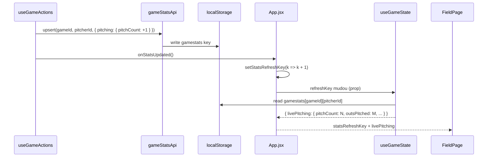

# Atualização em Tempo Real

O InPlay não usa WebSockets nem Server-Sent Events. Toda "reatividade em tempo real" é implementada via padrões locais dentro do React.

---

## Padrões de Atualização Reativa

### 1. `statsRefreshKey` — HUD do Arremessador

O HUD exibe PC (pitch count), IP (innings pitched) e ERA do arremessador atual. Esses dados vêm do `localStorage` via `useGameState`.

**Problema**: `useGameState` é um hook com `useEffect` — ele não re-executa automaticamente quando `localStorage` muda.

**Solução**: `statsRefreshKey` é um inteiro em `App.jsx` que é incrementado após cada escrita de stat. `useGameState` tem esse valor como dependência do `useEffect`, garantindo re-fetch.



**Fluxo**:
```
useGameActions.upsertGameStat(pitcherId, patch)
  → gameStatsApi.upsert(gameId, pitcherId, payload)     // escreve em LS
  → onStatsUpdated()                                     // callback de App.jsx
  → setStatsRefreshKey(k => k + 1)                      // incrementa trigger
  → useGameState re-executa useEffect                    // re-lê LS
  → livePitching atualizado no render
```

### 2. `gameState` — Estado da Partida

O React re-renderiza automaticamente qualquer componente que receba `gameState` como prop quando `setGameState` é chamado.

```
setGameState((current) => ({ ...current, outs: current.outs + 1 }))
  → React reconciliation
  → FieldPage re-renderiza
  → Campo, Scoreboard, HUD refletem novo estado
```

### 3. Debounce de Persistência — `useEffect`

Dois `useEffect` em `App.jsx` sincronizam o estado React com camadas de persistência:

```js
// Para localStorage:
useEffect(() => {
  const id = setTimeout(() => {
    localStorage.setItem(GAME_STATE_STORAGE_KEY, JSON.stringify(gameState))
  }, 350)
  return () => clearTimeout(id)
}, [gameState])

// Para backend:
useEffect(() => {
  if (!activeGame || !gameState.currentGameId) return
  const id = setTimeout(() => {
    gamesApi.update(activeGame._id, { gameState })
  }, 250)
  return () => clearTimeout(id)
}, [activeGame, gameState])
```

Ambos usam debounce de ~300ms para evitar flood de writes a cada keystroke.

### 4. Polling de Status do Time

App.jsx executa um `setInterval` a cada 30s para verificar se o time não foi bloqueado:

```js
const id = window.setInterval(() => {
  if (navigator.onLine) checkStatus().catch(() => {})
}, 30_000)
```

`checkStatus()` → `GET /auth/ping` → se 403, força logout.

---

## Anti-Double-Action: `isProcessingRef`

Dispositivos touch podem gerar múltiplos eventos pointer para um único toque. Para prevenir duplos registros de ação:

```js
const isProcessingRef = useRef(false)

// Em cada handler de ação:
if (isProcessingRef.current) return
isProcessingRef.current = true
window.setTimeout(() => { isProcessingRef.current = false }, 700)
```

Bloqueio de 700ms após qualquer ação. Não é exibido para o usuário.

---

## Screen Wake Lock

Durante jogo ativo, o app impede que a tela apague:

```js
// FieldPage.jsx
import { KeepAwake } from '@capacitor-community/keep-awake'

useEffect(() => {
  if (activeGame && !gameState.isFinished) {
    KeepAwake.keepAwake().catch(() => {})
  } else {
    KeepAwake.allowSleep().catch(() => {})
  }
  return () => { KeepAwake.allowSleep().catch(() => {}) }
}, [activeGame, gameState.isFinished])
```

Usa o plugin Capacitor — funciona no Android APK. No browser de desenvolvimento é no-op.

---

## Haptic Feedback

Ações de jogo disparam feedback tátil no Android:

```js
import { Haptics, ImpactStyle } from '@capacitor/haptics'

function haptic(style) {
  Haptics.impact({ style }).catch(() => {})
}

// Exemplo: strike
haptic(ImpactStyle.Medium)

// Exemplo: out / evento importante
haptic(ImpactStyle.Heavy)
```

`.catch(() => {})` silencia o erro no browser (onde Haptics não existe).

---

## Animações de Contagem

`setAnimatedBall(true)` dispara uma animação CSS nos indicadores de `CountDots` quando um pitch é registrado. Limpa após 600ms via `setTimeout`.

---

## Ausência de Sincronização Multi-Dispositivo

O InPlay **não sincroniza em tempo real entre dispositivos**. Se dois dispositivos abrirem o mesmo jogo:

- Cada um mantém seu `localStorage` independente.
- A sincronização com o backend ocorre ao montar a aplicação (`syncWithServer()`) e ao write de cada operação.
- Não há resolução de conflito — o último write vence no servidor.

Para o caso de uso atual (1 tablet por jogo), isso é suficiente.
