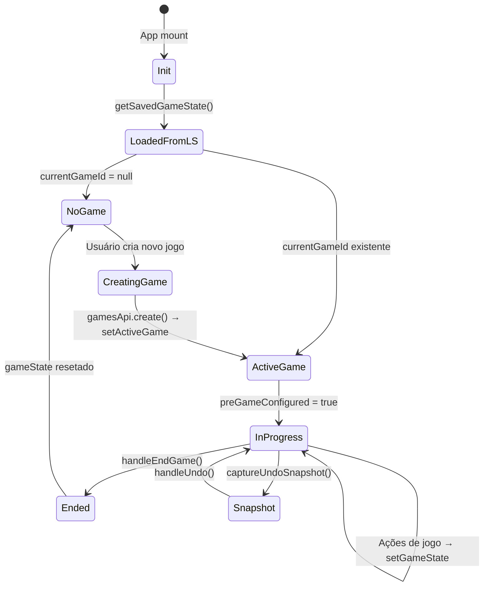

# Gerenciamento de Estado

O InPlay não usa Redux, Zustand, ou Context API. O estado é gerenciado por `useState` em `App.jsx` e propagado via props (prop drilling).

---

## Filosofia

1. **Estado mínimo**: Apenas o necessário vive em React state; o resto é derivado ou lido do localStorage.
2. **Prop drilling explícito**: Preferível a Context para evitar re-renders desnecessários e manter fluxo de dados rastreável.
3. **Persistência imediata**: Qualquer mudança de `gameState` é debounced e gravada em localStorage + backend.
4. **Imutabilidade**: Todo `setGameState` usa o padrão updater funcional com spread (`{ ...current, field: newVal }`).

---

## Hierarquia de Estado

```
App.jsx (source of truth)
│
├── auth                     { token, teamId, teamName, email }
├── page                     'game'|'training'|'jogadores'|'stats'|'settings'|'admin'
├── players                  Player[]
├── gameState                GameState (veja specs/game-state.md)
├── activeGame               Game|null
├── statsRefreshKey          number (trigger para useGameState)
├── syncStatus               'synced'|'syncing'|'offline'|'error'|'no-backend'
│
├── FieldPage.jsx (recebe via props, estado local de UI)
│   ├── gameSubView          'campo'|'acoes'
│   ├── strokes              StrokeData[] (canvas pen)
│   ├── selectedId           playerId selecionado no campo
│   ├── focusedPlayerId      playerId para modal de stats
│   ├── showPreGameSetup     boolean
│   ├── runnerBasePopover    { base, anchor }|null
│   ├── pendingSubstitution  { outId, inId }|null
│   ├── pendingDoublePlaySelect  { firstOutId, fieldPositions[] }|null
│   └── [outros estados de UI]
│
├── StatsPage.jsx (estado local)
│   ├── games                Game[]
│   ├── gameStats            GameStat[]
│   ├── seasonStats          AggregateStat[]
│   ├── viewingGameId        string|null
│   ├── statsTab             'hitters'|'pitchers'|'defense'
│   └── colSort              { col, dir }
│
└── JogadoresPage.jsx (estado local)
    ├── editingPlayer        Player|null
    ├── showLineupPicker     boolean
    └── search               string
```

---

## Padrões de Atualização

### gameState

```js
// Em App.jsx:
const updateGameState = useCallback((updater) => {
  setGameState(typeof updater === 'function' ? updater : () => updater)
}, [])

// Em componentes filhos (via onUpdateGameState prop):
onUpdateGameState((current) => ({
  ...current,
  outs: current.outs + 1,
  homeScore: current.homeScore + 1,
}))
```

**Regra**: Nunca mutação direta. Sempre spread + override de campo.

### players

```js
// Em App.jsx:
const handleUpdatePlayer = async (id, patch) => {
  const updated = await playersApi.update(id, patch)
  setPlayers(prev => prev.map(p => getPlayerId(p) === id ? updated : p))
}
```

**Regra**: `players` é sempre um array imutável — cria-se novo array com `map`/`filter`.

---

## Estado Derivado (Não Salvo)

Estes valores são computados na hora, não armazenados em state:

| Valor | Derivado de | Onde |
|-------|-------------|------|
| `playersById` | `players` | `usePlayers` |
| `fieldPlayers` | `players + gameState.onFieldPlayerIds` | `usePlayers` |
| `benchPlayers` | `players + gameState.onFieldPlayerIds` | `usePlayers` |
| `pitchersOnField` | `fieldPlayers` (filtra `positions.includes('P')`) | `usePlayers` |
| `livePitching` | `localStorage[gamestats]` | `useGameState` |
| `isAttacking` | `gameState.inningHalf === 'bottom'` | calculado inline |
| Estatísticas calculadas (AVG, ERA, etc.) | `hitting`/`pitching` raw | `utils/stats.js` |

---

## Ciclo de Vida do gameState



---

## Persistência

### localStorage (gameState)

```js
// Chave: 'baseball_game_state_v2' (global, não prefixada por teamId)
// Debounce: 350ms
// Hidratação: getSavedGameState() com validações e migrações
```

### localStorage (players, games, gameStats)

```js
// Chave: `baseball_lf_{teamId}_{name}_v1`
// Write imediato (sem debounce)
// Leitura: lfGet(key) retorna [] em caso de erro
```

### Backend

```js
// Game.gameState é salvo via PUT /games/:id com debounce de 250ms
// Player/GameStat são salvos imediatamente após cada create/update
// Falhas de sync: entram na syncQueue para retry
```

---

## Undo System

Até 80 snapshots do estado completo da partida.

```js
// Estrutura de um snapshot:
{
  gameState: { ...cópia completa do GameState },
  stats: GameStat[],   // cópia de todos os stats do jogo atual
}
```

### Captura

```js
// captureUndoSnapshot() é chamada antes de TODA ação de jogo
const snapshot = {
  gameState: { ...currentGameState },
  stats: gameStatsApi.listByGame(gameId),  // lê do localStorage
}
setUndoStack(prev => [...prev.slice(-79), snapshot])  // máximo 80
```

### Restauração

```js
// handleUndo():
// 1. Pega último snapshot
// 2. Restaura gameState via onUpdateGameState
// 3. Restaura stats via gameStatsApi.upsert para cada entry
// 4. Zera stats de jogadores criados após o snapshot
```

**Limitação**: O undo desfaz as stats armazenadas, mas não reverte eventos de log (`gameLog`) que foram adicionados. O `gameLog` do snapshot sobrescreve o atual, então na prática é revertido corretamente.

---

## syncQueue

Fila de operações pendentes de sync com o backend.

```js
// Estrutura:
[
  { method: 'post', url: '/players', data: {...}, _ts: 1234, localId: 'abc' },
  { method: 'put',  url: '/games/64...', data: {...}, _ts: 5678, localId: null },
]
```

- `flushWriteQueue()` processa em ordem FIFO.
- POST bem-sucedido: `localId` é remapeado para o ObjectId retornado (`replaceIdInStores`).
- Erros 4xx: descartados da fila (erro de cliente, não vai resolver sozinho).
- Erros de rede: permanecem na fila para próxima tentativa.
