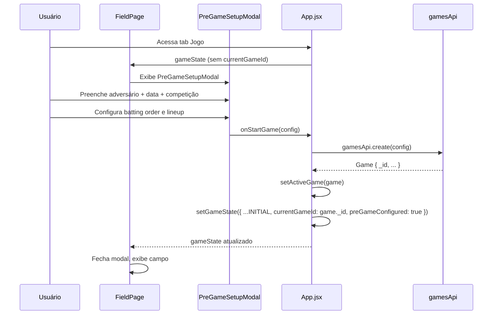

# Feature: Criação de Jogo

---

## Objetivo

Iniciar uma nova partida com configuração básica: adversário, data, competição, e lineup.

---

## Fluxo



---

## PreGameSetupModal — Campos

| Campo | Obrigatório | Descrição |
|-------|-------------|-----------|
| `opponent` / `opponentName` | Sim | Nome do time adversário |
| `date` | Sim | Data do jogo (default: hoje) |
| `competition` | Sim | Nome da competição/torneio |
| `location` | Não | Local do jogo |
| `maxInnings` | Não | Limite de innings (0 = ilimitado) |
| `isAttacking` | Sim | Se nosso time bate primeiro (default: true) |

---

## Configuração do Lineup

### Batting Order

- Lista ordenada dos `playerId` que batem.
- Pode ter de 1 a 9+ jogadores.
- O `currentBatterIndex` começa em 0 (primeiro da lista).

### Posições de Campo

- `lineup`: `[{ playerId, position }]` — mapeia cada jogador a uma posição.
- `onFieldPlayerIds`: array de IDs dos jogadores em campo (derivado de `lineup`).
- `bench`: jogadores disponíveis mas não em campo.

### Arremessador Inicial

O `currentPitcherId` é detectado automaticamente:

```js
// useEffect em App.jsx:
if (!gameState.currentPitcherId && gameState.preGameConfigured) {
  const pitcher = fieldPlayers.find(p =>
    getMainPosition(p) === 'P' || p.positions?.includes('P')
  )
  if (pitcher) {
    setGameState(prev => ({
      ...prev,
      currentPitcherId: getPlayerId(pitcher),
    }))
  }
}
```

---

## Retomar Jogo Existente

O app suporta continuar um jogo interrompido:

1. `getSavedGameState()` lê `baseball_game_state_v2` do localStorage.
2. Se `currentGameId` existe e o jogo não está finalizado (`!isFinished`), carrega o contexto.
3. `gamesApi.findById(currentGameId)` carrega o objeto Game.
4. O jogo continua do ponto onde parou.

```js
// openGameFromStats(gameId) — abre jogo a partir da lista de Stats:
const game = gamesApi.findById(gameId)
setActiveGame(game)
setGameState(game.gameState ?? INITIAL_GAME_STATE)
setPage('game')
```

---

## Jogo Criado Offline

Se o backend está indisponível ou `VITE_API_URL` não está configurado:

1. `gamesApi.create()` gera um ID local: `uid()` (`"abc123-xyz789"`).
2. O jogo é salvo em `localStorage`.
3. Uma entrada `{ method: 'post', url: '/games', data, localId }` entra na `syncQueue`.
4. Quando o servidor ficar disponível, `flushWriteQueue()` cria o jogo no backend e faz o remapping de IDs.

---

## Dados Criados ao Iniciar Jogo

| Store | O que é criado |
|-------|----------------|
| `gamesApi` | Game com lineup, battingOrder, config |
| `gameState` | `{ ...INITIAL_GAME_STATE, currentGameId, preGameConfigured: true, lineup, battingOrder, ... }` |
| `gameStats` | Nenhum ainda — criados sob demanda ao registrar primeiras ações |

---

## Encerrar Jogo

`handleEndGame()` em App.jsx:

```js
const handleEndGame = async () => {
  await gamesApi.update(activeGame._id, {
    isFinished: true,
    finishedAt: new Date().toISOString(),
    gameState: { ...gameState, isFinished: true },
  })
  setGameState(INITIAL_GAME_STATE)   // reseta estado da partida
  setActiveGame(null)
}
```

Após encerrar, o jogo fica disponível na lista de Stats com o estado final salvo.
