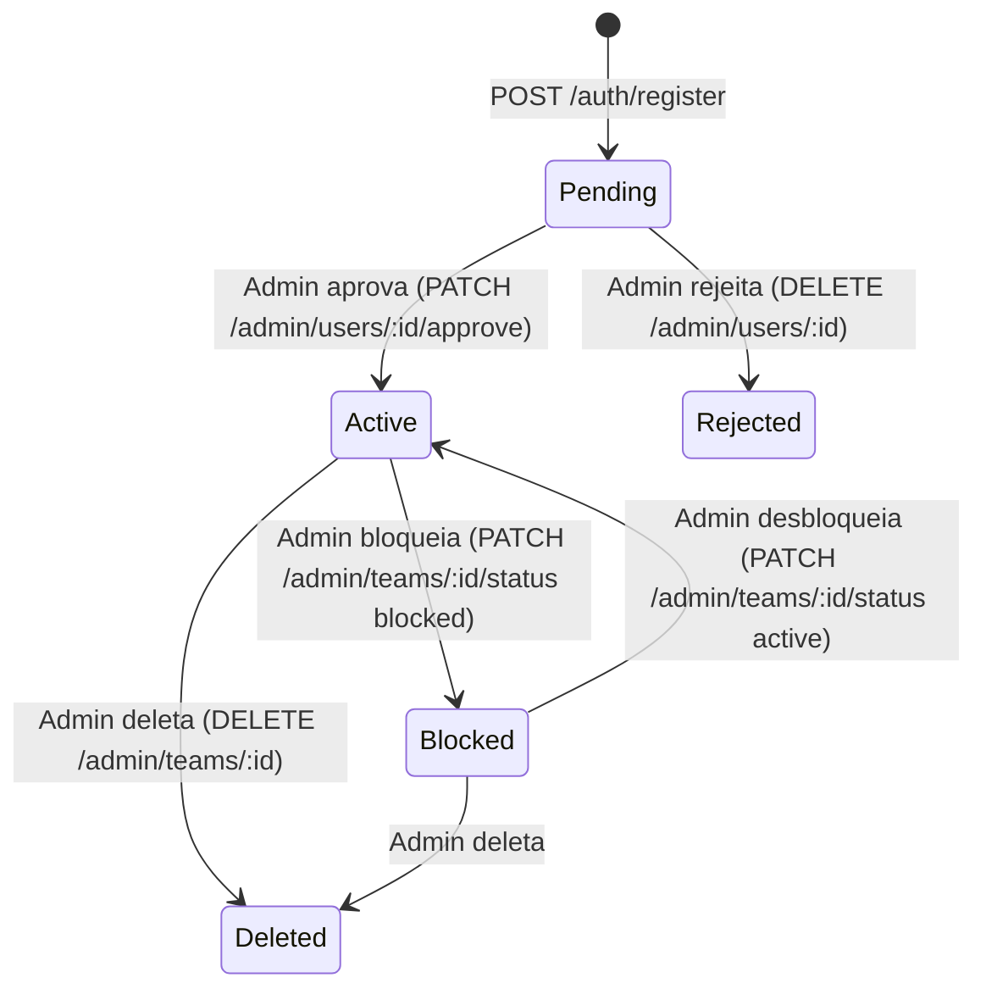

# Feature: Times (SaaS Multi-Tenant)

---

## Objetivo

O InPlay é um SaaS multi-tenant onde cada time é uma entidade isolada com seus próprios jogadores, jogos e estatísticas.

---

## Modelo de Time

```ts
interface Team {
  _id: string
  name: string
  status: 'active' | 'blocked'
  billingStatus: 'trial' | 'paid' | 'unpaid'
  billingNotes: string
  createdAt: string
  updatedAt: string
}
```

---

## Ciclo de Vida de um Time



---

## Isolamento de Dados

### Backend

Toda query ao MongoDB filtra por `teamId`:

```js
// Cada route handler usa req.user.teamId:
const players = await Player.find({ teamId: req.user.teamId })
const game = await Game.findOne({ _id: id, teamId: req.user.teamId })
```

Um time não pode ver dados de outro time, mesmo conhecendo o `_id`.

### Frontend (localStorage)

Chaves prefixadas com `teamId`:

```
baseball_lf_{teamId}_players_v1
baseball_lf_{teamId}_games_v1
baseball_lf_{teamId}_gamestats_v1
baseball_lf_{teamId}_syncqueue_v1
```

Ao fazer logout: todas as chaves do time atual são removidas.

---

## Múltiplos Times no Mesmo Dispositivo

É possível usar o mesmo dispositivo para diferentes times sequencialmente:

1. Time A faz login → dados carregados em `baseball_lf_{teamIdA}_*`.
2. Time A faz logout → dados de A são removidos.
3. Time B faz login → dados carregados em `baseball_lf_{teamIdB}_*`.

Os dados permanecem completamente isolados enquanto coexistem, mas um logout limpa tudo do time corrente.

---

## Status de Billing

| Status | Significado |
|--------|-------------|
| `trial` | Período de avaliação gratuito (default para novos times) |
| `paid` | Assinante ativo |
| `unpaid` | Pagamento em atraso |

O billing não bloqueia automaticamente o acesso — o admin precisa bloquear manualmente via `status: 'blocked'`. O `billingStatus` é informativo.

---

## Painel do Administrador

O `admin` é um usuário especial (`role: 'admin'`) com acesso ao painel de gestão:

- **`GET /admin/pending`**: Lista times aguardando aprovação.
- **`GET /admin/teams`**: Lista todos os times com usuários.
- **`PATCH /admin/users/:id/approve`**: Aprova usuário → `status: 'active'`.
- **`DELETE /admin/users/:id`**: Rejeita/remove usuário.
- **`PATCH /admin/teams/:teamId/status`**: Bloqueia/desbloqueia time.
- **`PATCH /admin/teams/:teamId/billing`**: Atualiza status de billing.
- **`DELETE /admin/teams/:teamId`**: Remove time e todos seus dados.

O admin **não vê** nem tem acesso a jogadores, jogos, ou estatísticas de nenhum time.

---

## Configurações do App (SettingsPage)

SettingsPage permite:

- Visualizar informações da conta (email, nome do time).
- Fazer logout.
- Limpar dados locais.
- Configurar preferências da UI (idioma, tema — futuro).
